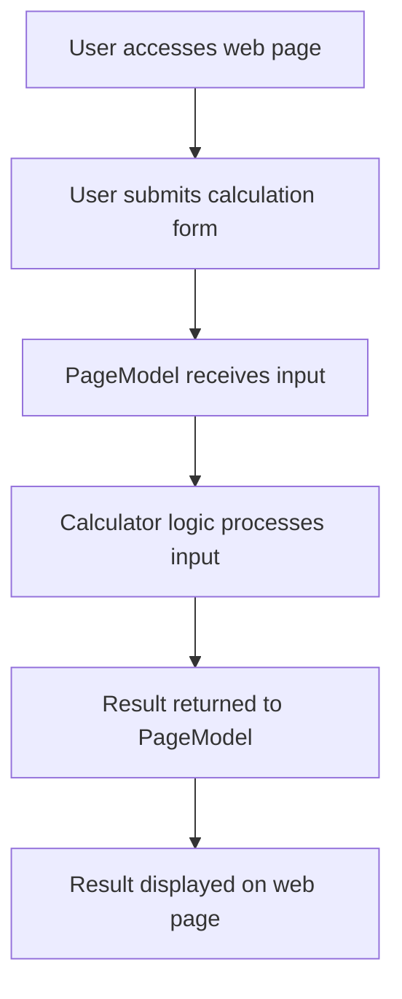

# เอกสารประกอบโปรเจกต์

## ภาพรวม

โปรเจกต์นี้เป็นเว็บแอปพลิเคชัน .NET ที่ให้บริการฟังก์ชันเครื่องคิดเลขอย่างง่าย โครงสร้างใช้ Razor Pages และเป็นไปตามมาตรฐานของ ASP.NET Core โดยมีส่วนประกอบหลักดังนี้:

- `Program.cs`: จุดเริ่มต้นและตั้งค่าการทำงานของเว็บแอปพลิเคชัน
- `calculator.cs`: ประกอบด้วยตรรกะการคำนวณของเครื่องคิดเลข
- `Options.cs`: กำหนดตัวเลือกการตั้งค่าต่าง ๆ ของแอปพลิเคชัน
- `Pages/Index.cshtml` และ `Pages/Index.cshtml.cs`: หน้าเว็บหลักและโค้ดเบื้องหลังของหน้าเว็บ

## Workflow

ด้านล่างนี้เป็นแผนภาพ workflow อย่างง่ายที่แสดงขั้นตอนการประมวลผลคำขอคำนวณของแอปพลิเคชัน:

## วิธีการทำงาน

1. ผู้ใช้เข้าสู่หน้าเว็บหลัก
2. ผู้ใช้กรอกตัวเลขและเลือกประเภทการคำนวณ (เช่น บวก ลบ) ในฟอร์ม
3. เมื่อส่งฟอร์ม ข้อมูลจะถูกส่งไปยัง PageModel ที่ฝั่งเซิร์ฟเวอร์
4. PageModel จะเรียกใช้ตรรกะเครื่องคิดเลขเพื่อประมวลผลและคำนวณผลลัพธ์
5. ผลลัพธ์จะถูกส่งกลับไปยัง PageModel และแสดงผลบนหน้าเว็บ

## รายละเอียดไฟล์

- `Program.cs`: ตั้งค่าและเริ่มต้นเว็บเซิร์ฟเวอร์
- `calculator.cs`: ตรรกะหลักของเครื่องคิดเลข
- `Options.cs`: จัดการตัวเลือกการตั้งค่า
- `Pages/Index.cshtml`: ส่วนติดต่อผู้ใช้หลัก
- `Pages/Index.cshtml.cs`: จัดการอินพุตและเอาต์พุตของผู้ใช้สำหรับหน้าแรก

---

หากต้องการรายละเอียดเพิ่มเติม สามารถดูได้จากไฟล์โค้ดใน repository นี้

---

## ช่อง YouTube แนะนำ

ติดตามเนื้อหาเกี่ยวกับเทคโนโลยีและโปรแกรมมิ่งเพิ่มเติมได้ที่ช่อง [dueHomeAlone](https://www.youtube.com/@dueHomeAlone)
